Collection of random metrics to gathered to improve xchain latency

 VAA Times 

## Acala
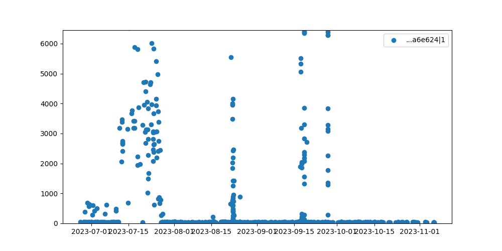

## Arbitrum

## Celo
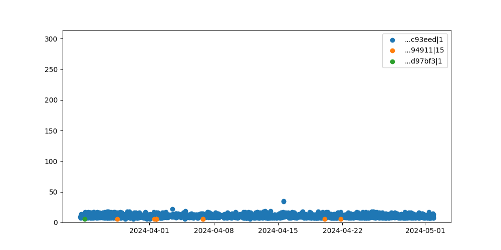

## Injective
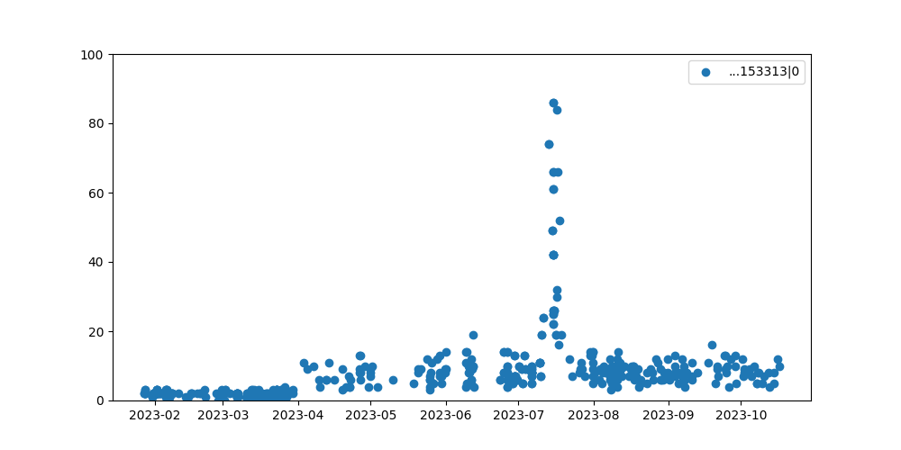

## Moonbeam
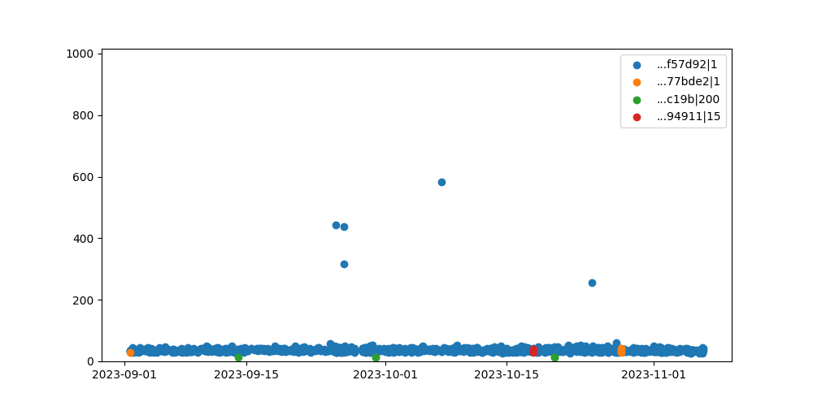

## Polygon
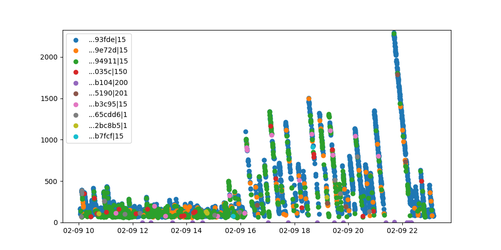

## Tera
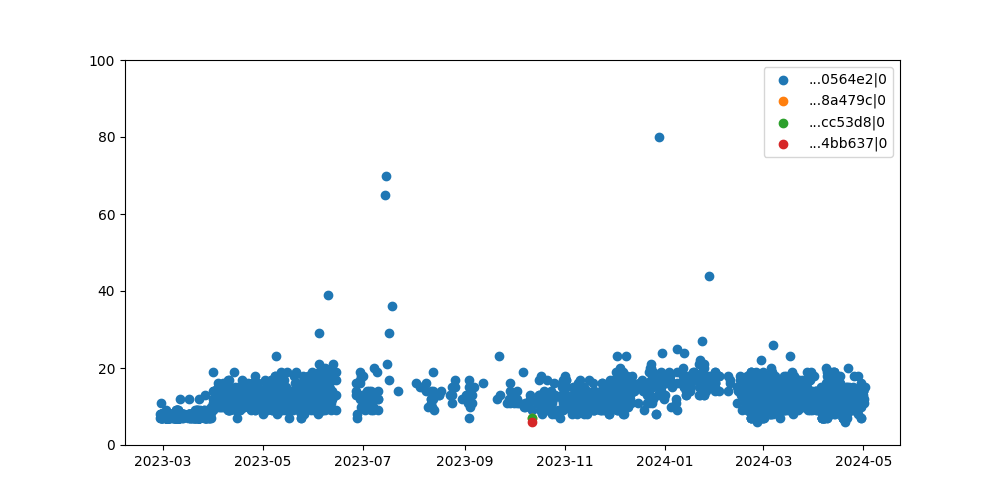

## Algorand
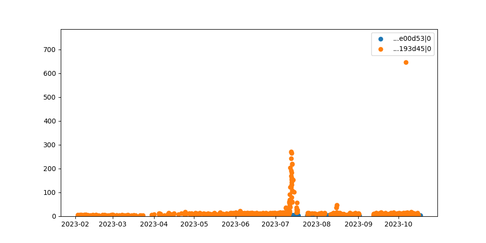

## Avalanche
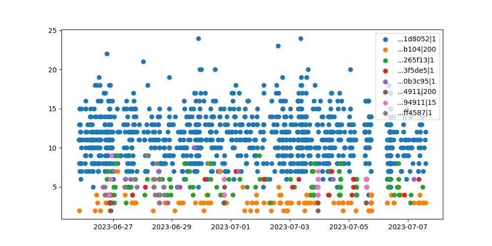

## Ethereum
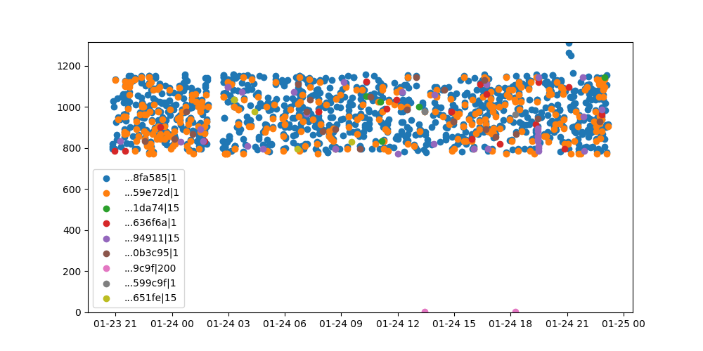

## Karura
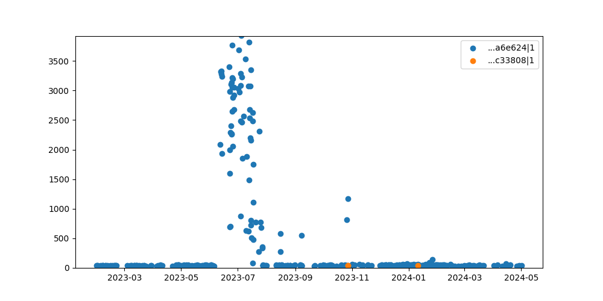

## Near
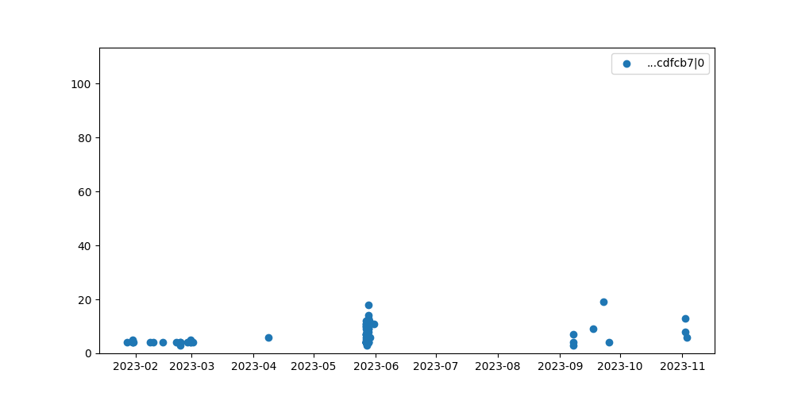

## Solana
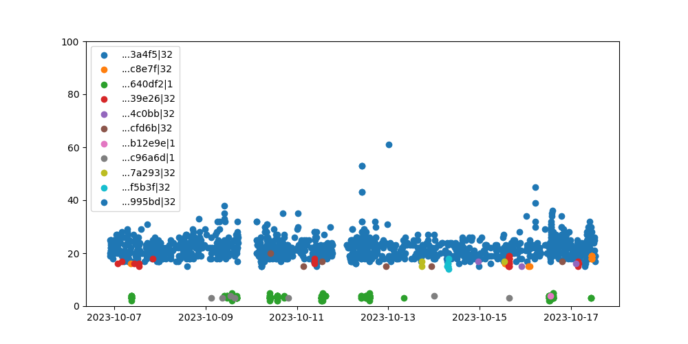

## XPLA
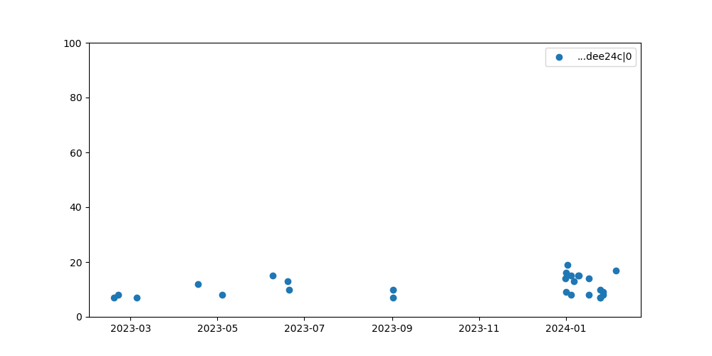

## Aptos
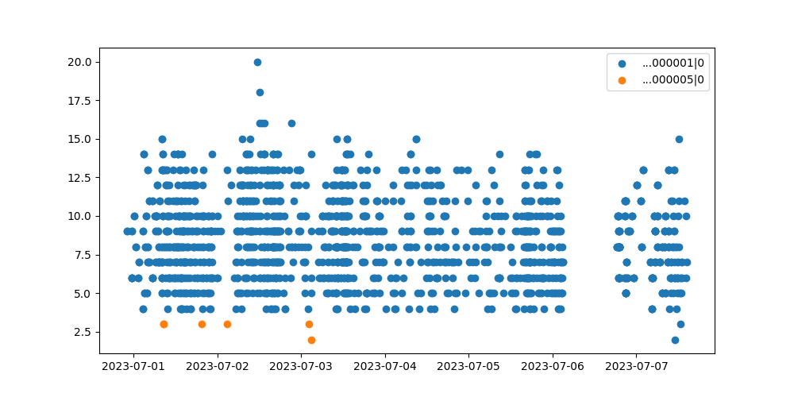

## BSC
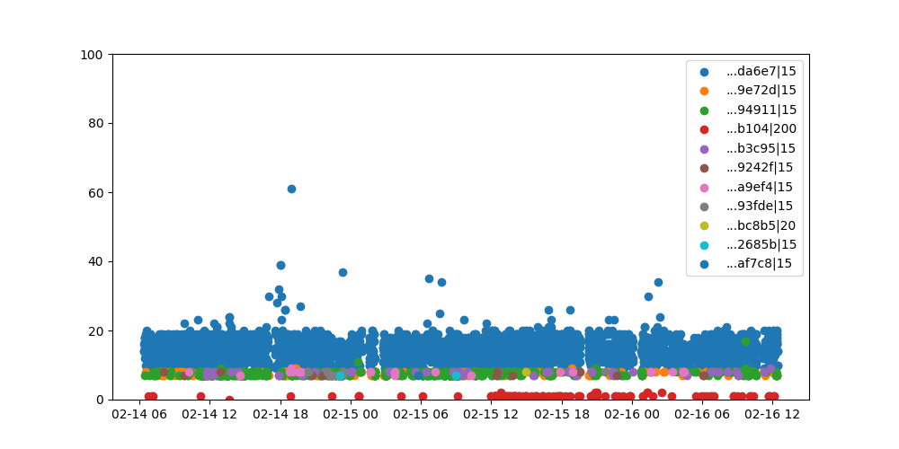

## Fantom
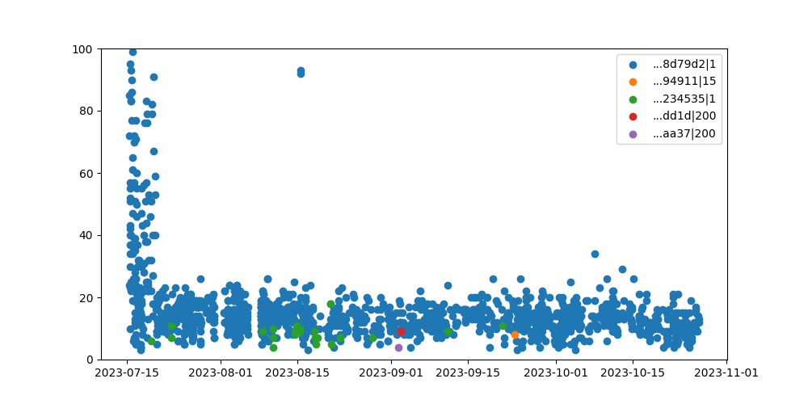

## Klaytn
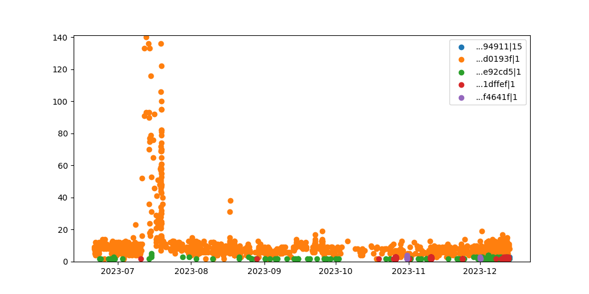

## Oasis
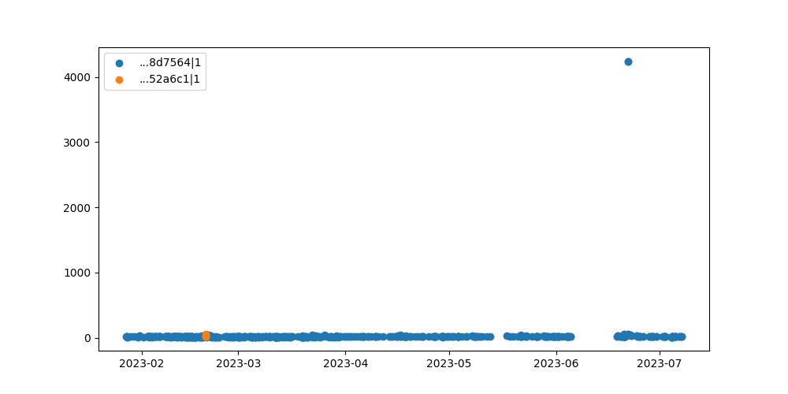

## Sui
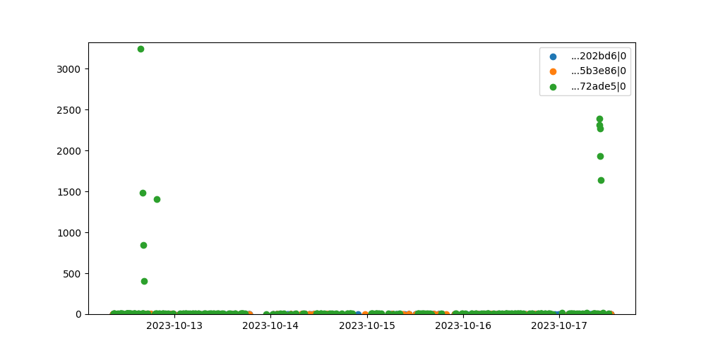

