Collection of random metrics to gathered to improve xchain latency

 VAA Times 

## Acala
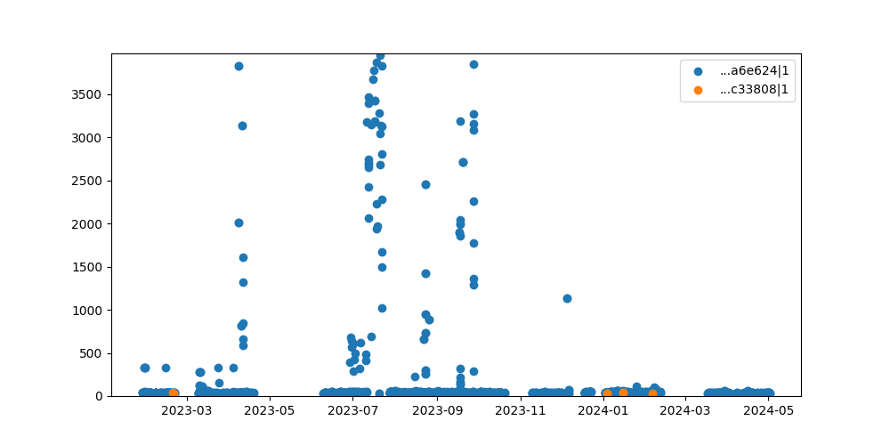

## Arbitrum
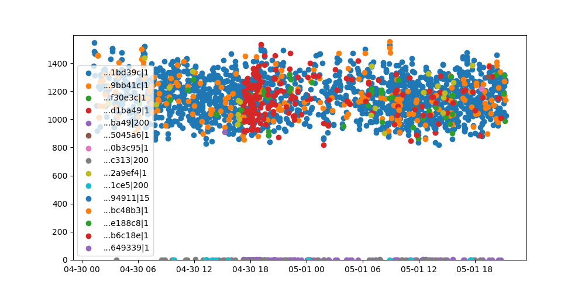

## Celo

## Injective
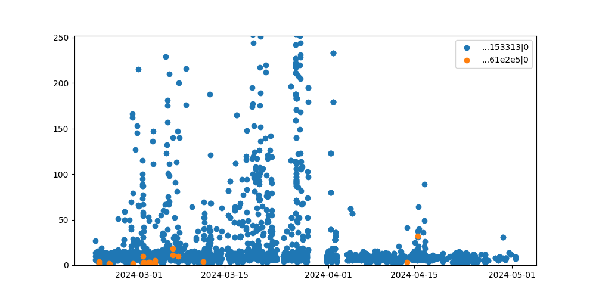

## Moonbeam
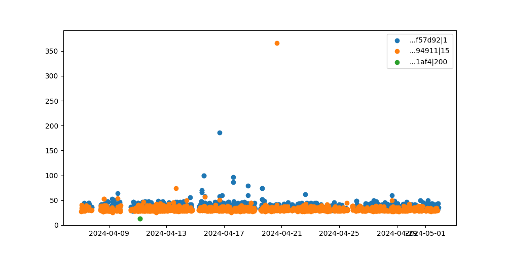

## Polygon
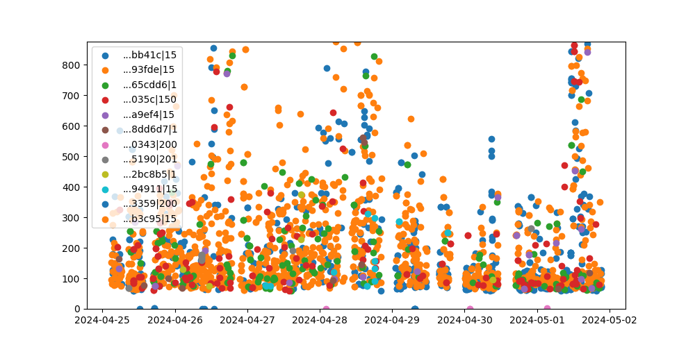

## Tera

## Algorand

## Avalanche
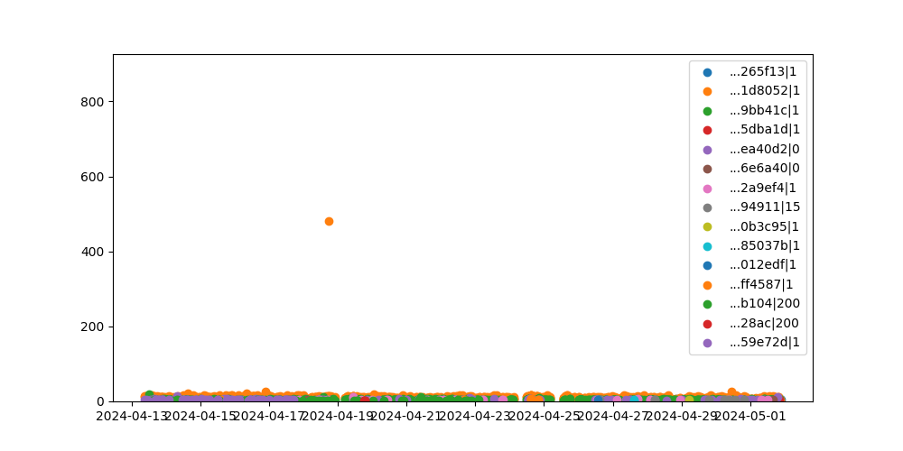

## Ethereum
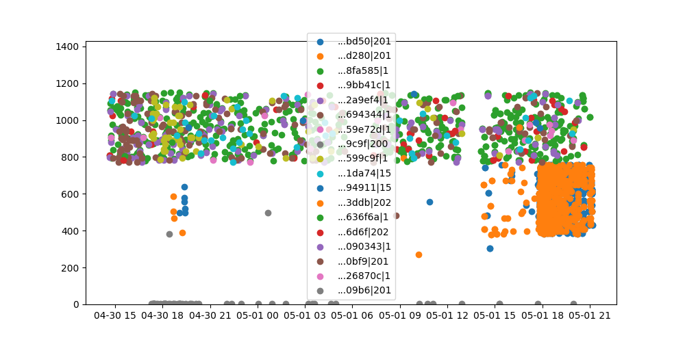

## Karura

## Near
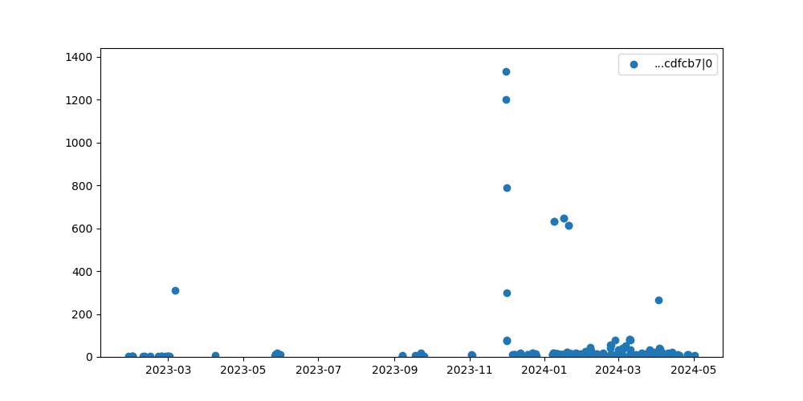

## Solana
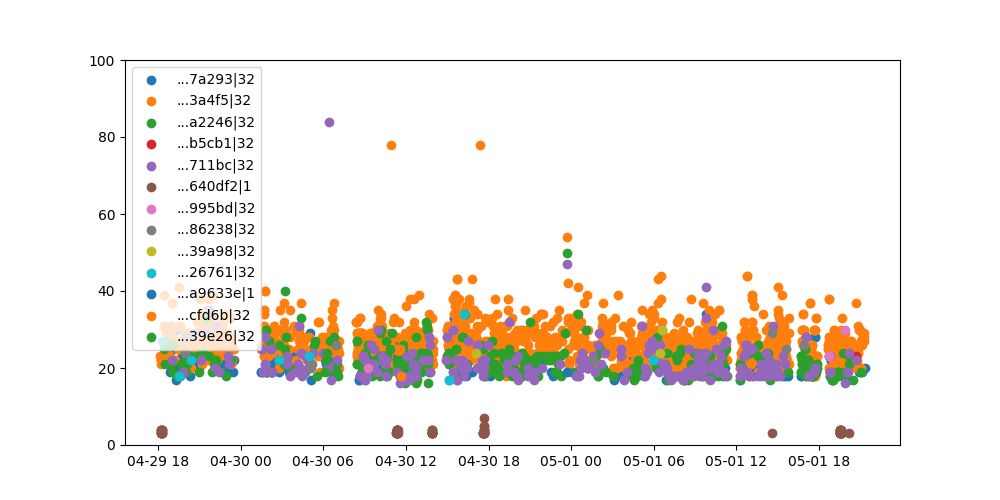

## XPLA
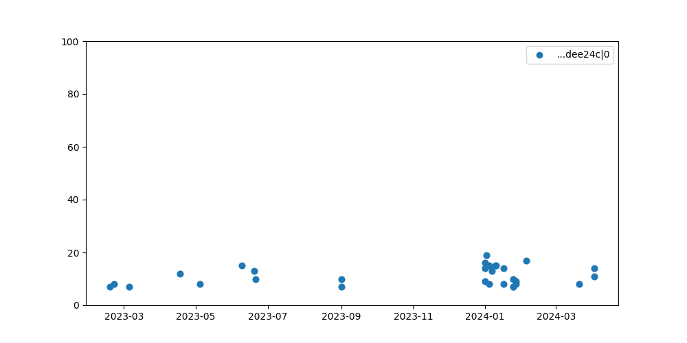

## Aptos
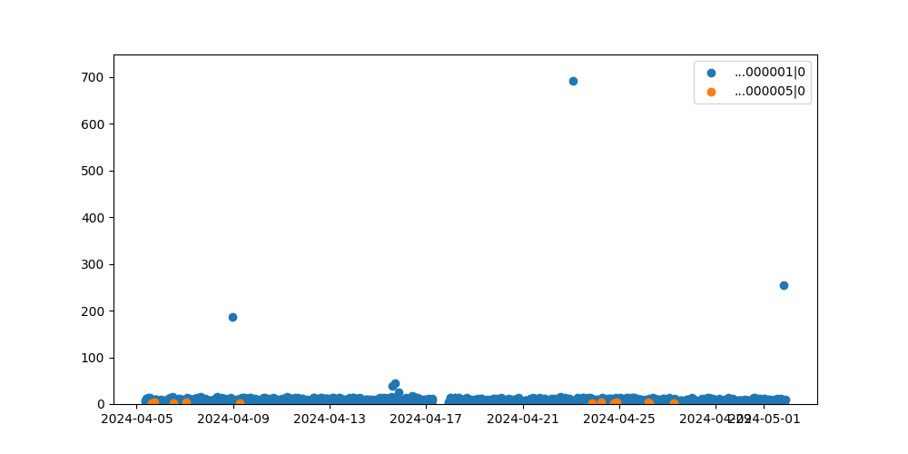

## BSC
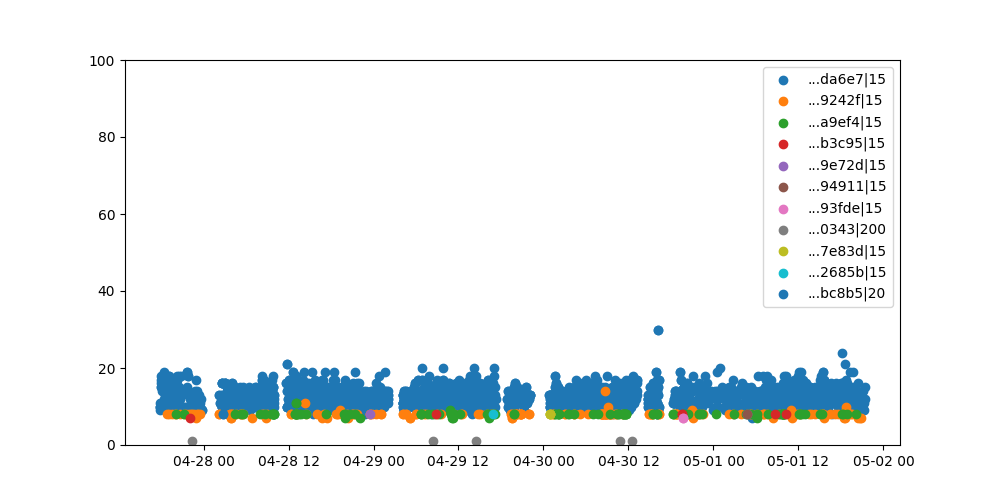

## Fantom
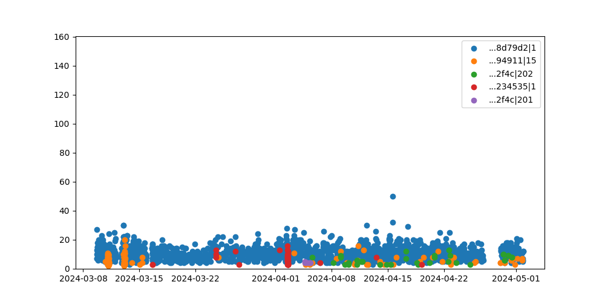

## Klaytn
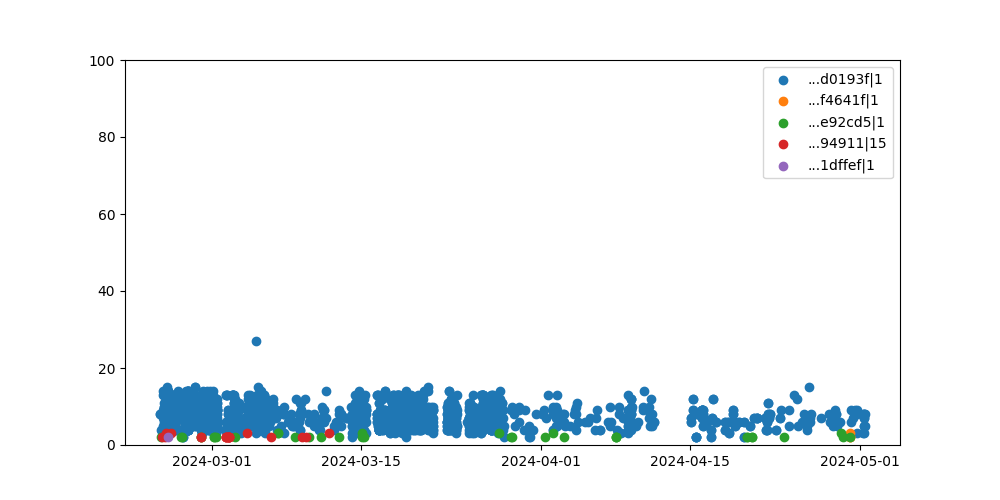

## Oasis
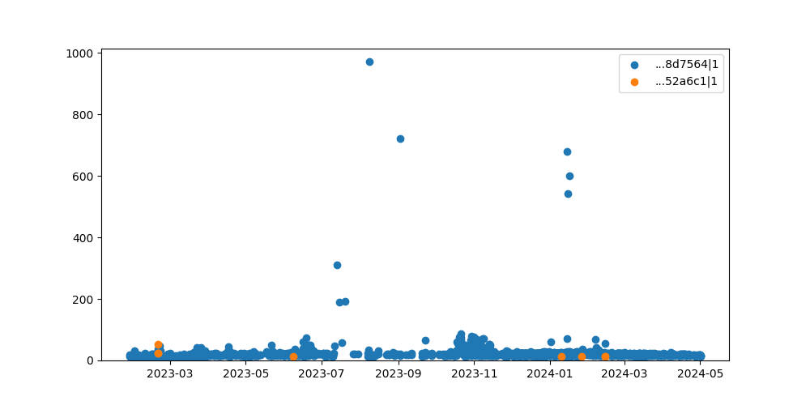

## Sui
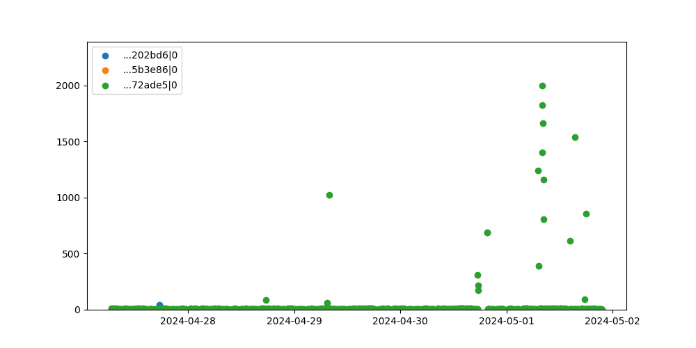

